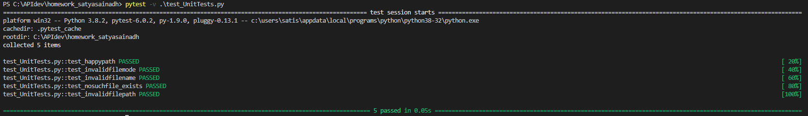

Assumptions:
------------
Considered that the file will contain one or more largest word(s). Hence the output is in list format.

Positive Test Cases:
--------------------
**Test_Case_1**: File name exists with a valid name and one largest word (Happy path scenario)  
**Test_Case_2**: File name exists with a valid name and more than one largest words  

Negative Test Cases:
---------------------
**Test_Case_1**: Invalid file path  
**Test_Case_2**: Invalid file name  
**Test_Case_3**: File name does not exist  
**Test_Case_4**: File Path does not exist  
**Test_Case_5**: File contains numbers or other data formats  
**Test_Case_6**: File contains binary data or data in an non-readable format  
**Test_Case_7**: Valid file path, file name and valid data but with invalid file permissions  
**Test_Case_8**: Testing the file with absolute/relative file path  

Unit Tests run results:
----------------------
